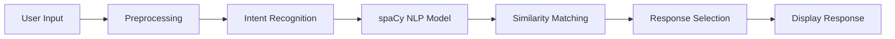

<div align="center">

# 🤖 Ai-Chatbot - Intelligent Chatbot System

### A Smart AI-Powered Chatbot with Dynamic Training Interface

[](https://www.python.org/)
[](https://flask.palletsprojects.com/)
[](https://spacy.io/)
[](https://www.nltk.org/)
[](LICENSE)

[Features](#-features) • [Installation](#-installation) • [Usage](#-usage) • [Configuration](#-configuration) • [Screenshots](#-screenshots) • [Author](#-author)

</div>

---

## 📖 About The Project

**Ai-Chatbot** is an intelligent, flexible chatbot system powered by Python and advanced Natural Language Processing (NLP). Designed to understand user queries, recognize intents, and provide accurate responses, this chatbot can be easily trained and customized to fit various use cases.

The system features a dual-interface approach:
- **User Interface** (`index.html`) - Clean, intuitive chatbot interaction
- **Admin Interface** (`train.html`) - Powerful training dashboard for managing intents and responses

Built with **spaCy** for natural language understanding and **Flask** for seamless web deployment, Ai-Chatbot makes conversational AI accessible and maintainable.

---

## ✨ Features

<table>
<tr>
<td width="50%">

### 🧠 Advanced NLP
- 🎯 Intent recognition using spaCy
- 📊 Semantic similarity matching
- 🔤 Word embeddings for better understanding
- 💬 Context-aware responses
- 🌐 Multi-intent handling
- 🔄 Continuous learning capability

</td>
<td width="50%">

### 🛠️ Training & Management
- ✏️ Dynamic intent creation
- 📤 File upload for knowledge enhancement
- 🔄 Real-time model retraining
- 📝 JSON-based intent management
- 📊 Training logs and monitoring
- 🎓 Easy response customization

</td>
</tr>
<tr>
<td width="50%">

### 🖥️ User Experience
- 💬 Interactive chat interface
- ⚡ Real-time responses
- 📱 Responsive design
- 🎨 Modern UI/UX
- 🔊 Chat history
- ⌨️ Keyboard shortcuts

</td>
<td width="50%">

### 🔧 Developer Friendly
- 🐍 Clean Python codebase
- 📦 Modular architecture
- 🔌 RESTful API endpoints
- 📚 Comprehensive documentation
- 🧪 Easy to extend
- 🚀 Quick deployment

</td>
</tr>
</table>

---

## 🚀 Installation

### Prerequisites

Before you begin, ensure you have the following installed:

- 🐍 **Python 3.7 or higher**
- 📦 **pip** (Python package manager)
- 💻 **Git** (optional, for cloning)
- 🌐 A modern web browser

### Step-by-Step Guide

#### 1️⃣ Clone the Repository

```bash
# Navigate to your projects folder
cd /path/to/your/projects

# Clone the repository
git clone https://github.com/NazifaTasnimShifa/Ai-Chatbot.git

# Navigate into the project directory
cd Ai-Chatbot

# Or download ZIP from GitHub and extract
```

#### 2️⃣ Create Virtual Environment (Recommended)

```bash
# Create virtual environment
python -m venv venv

# Activate virtual environment

# On Windows:
venv\Scripts\activate

# On macOS/Linux:
source venv/bin/activate
```

#### 3️⃣ Install Dependencies

```bash
# Install all required packages
pip install -r requirements.txt
```

**If `requirements.txt` is not available, install manually:**

```bash
pip install flask numpy nltk spacy scikit-learn
```

#### 4️⃣ Download spaCy Language Model

```bash
# Download the large English model (recommended for better accuracy)
python -m spacy download en_core_web_lg

# Alternative: Medium model (smaller, faster but less accurate)
python -m spacy download en_core_web_md
```

#### 5️⃣ Download NLTK Data (if required)

```python
# Run Python and execute:
python -c "import nltk; nltk.download('punkt'); nltk.download('wordnet')"
```

#### 6️⃣ Initial Setup

```bash
# Initialize the intents database (if needed)
# Create data folder if it doesn't exist
mkdir -p data

# Train the initial model
python train.py
```

#### 7️⃣ Run the Application

```bash
# Start the Flask server
python main.py

# The application will be available at:
# http://localhost:5000
```

> **✅ Success!** Open your browser and navigate to `http://localhost:5000` to start chatting!

---

## ⚙️ Configuration

### Setting Up Intents

The chatbot's knowledge is stored in `data/intents.json`. Here's the structure:

```json
{
  "intents": [
    {
      "tag": "greeting",
      "patterns": [
        "Hi",
        "Hello",
        "Good morning",
        "Hey there"
      ],
      "responses": [
        "Hello! How can I help you today?",
        "Hi there! What can I do for you?",
        "Greetings! How may I assist you?"
      ]
    },
    {
      "tag": "goodbye",
      "patterns": [
        "Bye",
        "See you later",
        "Goodbye",
        "Take care"
      ],
      "responses": [
        "Goodbye! Have a great day!",
        "See you later!",
        "Take care!"
      ]
    }
  ]
}
```

### Flask Configuration

Edit `main.py` to customize server settings:

```python
# Change host and port
app.run(host='0.0.0.0', port=5000, debug=True)

# For production:
app.run(host='0.0.0.0', port=5000, debug=False)
```

### Environment Variables (Optional)

Create a `.env` file for configuration:

```env
FLASK_APP=main.py
FLASK_ENV=development
FLASK_DEBUG=1
SECRET_KEY=your-secret-key-here
HOST=0.0.0.0
PORT=5000
```

---

## 📁 Project Structure

```
Ai-Chatbot/
├── 📄 main.py                      # Main Flask application
├── 📄 train.py                     # Model training script
├── 📄 requirements.txt             # Python dependencies
├── 📄 README.md                    # Project documentation
├── 📄 .env                         # Environment variables (optional)
├── 📄 .gitignore                   # Git ignore file
│
├── 📂 templates/
│   ├── index.html                  # User chat interface
│   └── train.html                  # Admin training interface
│
├── 📂 static/
│   ├── 📂 css/
│   │   ├── style.css               # Main styles
│   │   └── chat.css                # Chat-specific styles
│   ├── 📂 js/
│   │   ├── chat.js                 # Chat functionality
│   │   └── train.js                # Training interface logic
│   └── 📂 images/
│       ├── logo.png
│       └── bot-avatar.png
│
├── 📂 data/
│   └── intents.json                # Chatbot intents and responses
│
├── 📂 models/
│   ├── chatbot_model.pkl           # Trained model (generated)
│   └── vectorizer.pkl              # Feature vectorizer (generated)
│
├── 📂 screenshots/
│   ├── screenshot1.png             # Chat interface screenshot
│   └── screenshot2.png             # Training interface screenshot
│
└── 📂 uploads/                     # Uploaded training files
    └── .gitkeep
```

---

## 💻 Usage

### For End Users

1. **Access the Chatbot**
   ```
   http://localhost:5000
   ```

2. **Start Chatting**
   - Type your question in the input box
   - Press Enter or click Send
   - Receive instant AI-powered responses

3. **Features**
   - View chat history
   - Clear conversation
   - Get suggestions

### For Administrators

1. **Access Training Interface**
   ```
   http://localhost:5000/train
   ```

2. **Add New Intents**
   - Enter intent tag (e.g., "weather")
   - Add multiple patterns (user queries)
   - Add multiple responses
   - Click "Add Intent"

3. **Upload Training Files**
   - Select text/JSON files
   - Upload to enhance knowledge base
   - System automatically processes

4. **Retrain Model**
   ```bash
   python train.py
   ```

### API Endpoints

```bash
# Chat endpoint
POST /chat
Content-Type: application/json
{
  "message": "Hello, how are you?"
}

# Response
{
  "response": "Hi! I'm doing great. How can I help you today?"
}

# Add intent endpoint
POST /add-intent
Content-Type: application/json
{
  "tag": "weather",
  "patterns": ["What's the weather?", "How's the weather today?"],
  "responses": ["I don't have weather data, but you can check weather.com"]
}

# Upload file endpoint
POST /upload
Content-Type: multipart/form-data
file: [file data]
```

---

## 🖼️ Screenshots

<div align="center">

### 💬 Chatbot Interface


*Clean and intuitive user interface for seamless conversations*

---

### 🎓 Training Dashboard


*Powerful admin panel for managing intents and training the chatbot*

</div>

---

## 🛠️ Technology Stack

<div align="center">

| Technology | Version | Purpose |
|------------|---------|---------|
|  | 3.7+ | Core Programming Language |
|  | 2.x | Web Framework |
|  | 3.x | NLP & Intent Recognition |
|  | 3.x | Text Processing |
|  | Latest | Numerical Computing |
|  | Latest | Machine Learning |
|  | 5 | Frontend Structure |
|  | 3 | Styling |
|  | ES6+ | Frontend Logic |

</div>

---

## 🎯 How It Works



### Processing Pipeline

1. **Input Processing** - User message is received and preprocessed
2. **Tokenization** - Text is broken into tokens using NLTK/spaCy
3. **Intent Recognition** - spaCy model identifies the intent
4. **Similarity Matching** - Semantic similarity calculated using word embeddings
5. **Response Selection** - Best matching response is selected
6. **Output** - Response is sent back to the user

---

## 🤝 Contributing

Contributions make the open-source community an amazing place to learn, inspire, and create. Any contributions you make are **greatly appreciated**!

### How to Contribute

1. **Fork the Project**
2. **Create Feature Branch**
   ```bash
   git checkout -b feature/AmazingFeature
   ```
3. **Commit Changes**
   ```bash
   git commit -m 'Add some AmazingFeature'
   ```
4. **Push to Branch**
   ```bash
   git push origin feature/AmazingFeature
   ```
5. **Open Pull Request**

### Contribution Ideas

- 🌐 Add multi-language support
- 🎨 Improve UI/UX design
- 🧠 Enhance NLP capabilities
- 📊 Add analytics dashboard
- 🔊 Implement voice chat
- 💾 Add database integration
- 🔐 Implement user authentication

---

## 🐛 Known Issues & Troubleshooting

<details>
<summary><b>🔍 Click to expand troubleshooting guide</b></summary>

### Issue: ModuleNotFoundError: No module named 'spacy'

**Solution:**
```bash
pip install spacy
python -m spacy download en_core_web_lg
```

### Issue: Can't find model 'en_core_web_lg'

**Solution:**
```bash
# Download the model explicitly
python -m spacy download en_core_web_lg

# Or use medium model
python -m spacy download en_core_web_md
```

### Issue: Flask app not running

**Solution:**
- Check if port 5000 is available
- Run with different port:
  ```python
  app.run(port=5001)
  ```
- Check Python version (3.7+ required)

### Issue: Training not working

**Solution:**
- Ensure `data/intents.json` exists and is valid JSON
- Check write permissions in `models/` folder
- Verify all dependencies are installed

### Issue: Poor response accuracy

**Solution:**
- Add more training patterns in `intents.json`
- Use larger spaCy model (`en_core_web_lg`)
- Retrain the model after adding data

### Issue: Chat interface not loading

**Solution:**
- Check Flask console for errors
- Verify `templates/index.html` exists
- Clear browser cache
- Check browser console for JS errors

</details>

---

## 📚 Documentation

### Adding Custom Intents

1. Open `data/intents.json`
2. Add new intent object:
```json
{
  "tag": "your_intent_name",
  "patterns": [
    "Pattern 1",
    "Pattern 2",
    "Pattern 3"
  ],
  "responses": [
    "Response 1",
    "Response 2"
  ]
}
```
3. Run `python train.py` to retrain
4. Restart the Flask server

### Customizing Responses

You can make responses dynamic by:
- Adding variables in response templates
- Integrating external APIs
- Using database lookups
- Implementing conditional logic

---

## 🚀 Deployment

### Deploy to Heroku

```bash
# Install Heroku CLI and login
heroku login

# Create new app
heroku create your-chatbot-name

# Add buildpack
heroku buildpacks:add heroku/python

# Deploy
git push heroku main

# Open app
heroku open
```

### Deploy to PythonAnywhere

1. Upload code to PythonAnywhere
2. Create a new web app
3. Configure WSGI file
4. Install dependencies
5. Reload web app

### Deploy with Docker

```dockerfile
FROM python:3.9-slim

WORKDIR /app

COPY requirements.txt .
RUN pip install -r requirements.txt
RUN python -m spacy download en_core_web_lg

COPY . .

EXPOSE 5000

CMD ["python", "main.py"]
```

---

## 📝 License

Distributed under the MIT License. See `LICENSE` file for more information.

---

## 👨‍💻 Author

<div align="center">

### **Nazifa Tasnim Shifa**

[](https://www.linkedin.com/in/nazifa-tasnim-shifa)
[](https://github.com/NazifaTasnimShifa)

**Software Developer | AI/NLP Enthusiast**

</div>

---

## 📞 Support

Need help? We're here for you!

- 📧 **Create an Issue**: [GitHub Issues](https://github.com/NazifaTasnimShifa/Ai-Chatbot/issues)
- 💬 **Start a Discussion**: [GitHub Discussions](https://github.com/NazifaTasnimShifa/Ai-Chatbot/discussions)
- 📖 **Read the Docs**: Check the `/docs` folder
- 💡 **Feature Request**: Open an issue with the "enhancement" label

---

## 🙏 Acknowledgments

- [spaCy](https://spacy.io/) for excellent NLP capabilities
- [Flask](https://flask.palletsprojects.com/) for the web framework
- [NLTK](https://www.nltk.org/) for text processing tools
- All contributors and supporters of this project

---

## 📊 Project Stats

<div align="center">


</div>

---

<div align="center">

### ⭐ Star this repository if you find it helpful!

### 🔔 Watch for updates and new features!

**Made with ❤️ and 🤖 by Nazifa Tasnim Shifa**

---

*Last Updated: 2024*

</div>